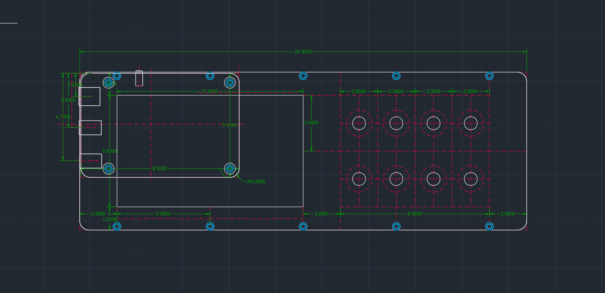
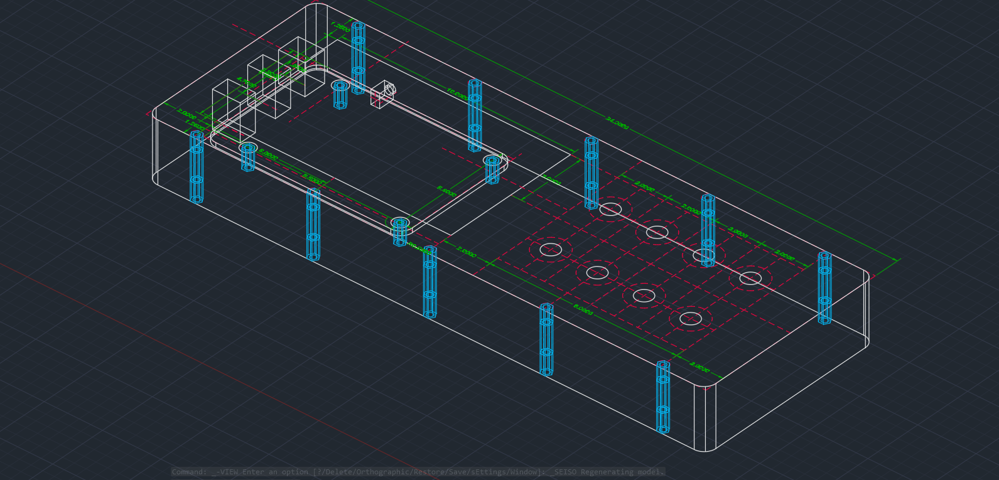

# The Zynthian case and my lust for digital instruments.

This repository will track the progress of a new instrument I plan on creating. Initially, it is just going to be a Raspberry Pi inside of an AmazonBasics office accessory tray. It'll run Zynthian at first,  but the Pi will make it rather easy to develop for. It is to feature a 4.5 inch screen, and at least four push button encoders. Originally, I began mocking this up in AutoCAD to be solely a Zynthian box.

I would like to expand it with other I/O methods at some point though. I would really like to see the inclusion of mechanical keyboard switches in the faceplate, or perhaps a dedicated PCB. Seeing instrument like the Dirtywave M8 tracker using choc switches gives me a lot of hope that this sort of idea can take off-- these sort of portable DIY software and hardware instruments that take advantage of microcomputers to pack a lot of musical power into a tiny little package. While this repository will specifically track my progress of the physical design of the Zynthian box, I would really like to expand on this physical design with other hardware, such as a Teensy. Hopefully, it can also present an interesting avenue for my to learn about audio programming and DSP through practice. As always, ideas and advice are always appreciated :D
